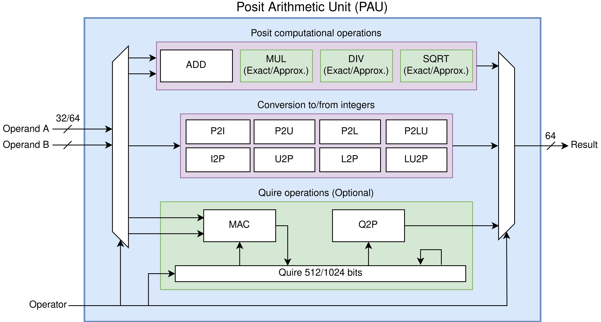

# PERCIVAL: Open-Source Posit RISC-V Core with Quire Capability

PERCIVAL is an application-level posit capable RISC-V core based on CVA6 that can execute all posit instructions, including the quire fused operations.

You can find the Xposit RISC-V custom extension for posit arithmetic used together with this repository here: <https://github.com/artecs-group/llvm-xposit>

You can find the original CVA6 repo with additional documentation here: <https://github.com/openhwgroup/cva6>

## 64-bit version (Big-PERCIVAL)

Here you can also find Big-PERCIVAL, an updated version of PERCIVAL which adds posit64 operations and increased flexibility in the PAU. You can read about it in our pre-print: <https://doi.org/10.48550/arXiv.2305.06946>

For the original PERCIVAL code switch to the `posit-master` branch. However, we recommend using the current default `big-percival-main` branch, as this also supports 32-bit posits.

## Publication

If you use PERCIVAL in your academic work you can cite us:

D. Mallasén, R. Murillo, A. A. D. Barrio, G. Botella, L. Piñuel, and M. Prieto-Matias, “PERCIVAL: Open-Source Posit RISC-V Core With Quire Capability,” IEEE Transactions on Emerging Topics in Computing, vol. 10, no. 3, pp. 1241–1252, 2022, doi: 10.1109/TETC.2022.3187199.

D. Mallasén, A. A. Del Barrio, and M. Prieto-Matias, “Big-PERCIVAL: Exploring the Native Use of 64-Bit Posit Arithmetic in Scientific Computing.” arXiv [cs.AR], 2023. Available: <http://arxiv.org/abs/2305.06946>

~~~bibtex
@article{mallasen2022PERCIVAL,
  title = {PERCIVAL: Open-Source Posit RISC-V Core With Quire Capability},
  author = {Mallasén, David and Murillo, Raul and Del Barrio, Alberto A. and Botella, Guillermo and Piñuel, Luis and Prieto-Matias, Manuel},
  year = {2022},
  journal = {IEEE Transactions on Emerging Topics in Computing},
  volume = {10},
  number = {3},
  pages = {1241-1252},
  issn = {2168-6750},
  doi = {10.1109/TETC.2022.3187199}
}

@misc{mallasen2023BigPERCIVAL,
  title = {Big-PERCIVAL: Exploring the Native Use of 64-Bit Posit Arithmetic in Scientific Computing},
  author = {Mallasén, David and Del Barrio, Alberto A. and Prieto-Matias, Manuel},
  year = {2023},
  month = may,
  eprint = {2305.06946},
  primaryclass = {cs.AR},
  archiveprefix = {arXiv}
}
~~~

## Posit Arithmetic Unit (PAU)

The top-level module of the PAU can be found in `core/pau_top.sv`. The individual arithmetic modules are in `core/pau/`. You can configure the PAU changing the parameters in `core/include/ariane_pkg.sv`.

## Getting Started

The following instructions will get you a copy of the project up and running on your local machine and run the posit testsuite using the QuestaSim simulator. If you run into problems, look at the [troubleshooting](#troubleshooting-the-installation) section.

### 1. Prerequisites

These instructions assume you have the [LLVM Xposit](https://github.com/artecs-group/llvm-xposit) compiler and the [QuestaSim](https://eda.sw.siemens.com/en-US/ic/questa/simulation/advanced-simulator/) simulator installed in your system. Also, on a fresh Ubuntu 22.04 installation you will need to install the following packages:

~~~bash
sudo apt install -y git curl gcc g++ make autoconf device-tree-compiler screen
~~~

Make sure you have the `$RISCV` environment variable pointing to the directory where you installed the RISC-V gcc toolchain. E.g. `export RISCV="/opt/riscv`. Consider adding this permanently in your `.bashrc` file.

### 2. Checkout the repository

To set up the repository, run:

~~~bash
git clone https://github.com/artecs-group/PERCIVAL.git
cd PERCIVAL
git submodule update --init --recursive
mkdir tmp
./ci/install-riscvpk.sh
~~~

### 3. Compile the posit testsuite

To compile the posit64 testsuite, you must use the next command:

~~~bash
clang --target=riscv64 -march=rv64gcxposit posit64_testsuite_llvm.c -c -o posit64_testsuite_llvm.o
riscv64-unknown-elf-gcc posit64_testsuite_llvm.o -o posit64_testsuite_llvm.elf
~~~

(Optional) Once the `.elf` executable has been generated, you can create visualize the generated assembly code with:

~~~bash
riscv64-unknown-elf-objdump -DC posit64_testsuite_llvm.elf > posit64_testsuite_llvm.dump
~~~

### 4. Simulate the posit testsuite

To run the simulation, execute:

~~~bash
make sim elf-bin=$RISCV/riscv64-unknown-elf/bin/pk target-options=posit64_testsuite_llvm.elf batch-mode=1
~~~

You should see the following output at the end of the simulation:

~~~text
PADD test OK
PSUB test OK
PMUL test OK
PDIV test OK
PSQRT test OK
PMIN test OK
PMAX test OK
QUIRE test OK
PCVTWS test OK
PCVTWUS test OK
PCVTLS test OK
PCVTLUS test OK
PCVTSW test OK
PCVTSWU test OK
PCVTSL test OK
PCVTSLU test OK
PSGNJ test OK
PSGNJN test OK
PSGNJNX test OK
PMVXW test OK
PMVWX test OK
PEQ test OK
PLT test OK
PLE test OK
~~~

Note: If you want to use the QuestaSim GUI, remove the `batch-mode=1` option from the `make sim` command.

### 5. Running on FPGA

PERCIVAL is designed to be used with the [Genesys II](https://digilent.com/reference/programmable-logic/genesys-2/start) board.

#### 5.1 Generating the FPGA bitstream

  To generate the FPGA bitstream of PERCIVAL run `make fpga`.
  This will produce a bitstream file and memory configuration file in `corev_apu/fpga/work-fpga/`.

#### 5.2 Programming the Memory Configuration File

  1. Connect the FPGA to the PC using the **JTAG** port and turn it on.
  2. Open Vivado.
  3. Open the Hardware Manager.
  4. Open the target board (Genesys II `xc7k325t`).
  5. Tools -> Add Configuration Memory Device -> `xc7k325t`.
  6. Select Configuration Memory Part -> Spansion SPI flash `s25fl256sxxxxxx0`.
  7. Program the configuration memory device with the configuration file `ariane_xilinx.mcs` generated in `corev_apu/fpga/work-fpga/`.
  8. Press ok. Flashing will take a couple of minutes.
  9. Exit Vivado and turn off the FPGA.

#### 5.3 Creating a Linux SD image

  1. Insert the SD card to the PC.
  2. Clone the [cva6-sdk](https://github.com/openhwgroup/cva6-sdk/tree/176923f60efb9348dfa907412873dadbfd59319c) repository and follow the [Quickstart](https://github.com/openhwgroup/cva6-sdk/tree/176923f60efb9348dfa907412873dadbfd59319c?tab=readme-ov-file#quickstart).

      ~~~bash
      git clone https://github.com/openhwgroup/cva6-sdk.git
      git checkout 176923f60efb9348dfa907412873dadbfd59319c
      sudo apt-get install autoconf automake autotools-dev curl libmpc-dev libmpfr-dev libgmp-dev libusb-1.0-0-dev gawk build-essential bison flex texinfo gperf libtool patchutils bc zlib1g-dev device-tree-compiler pkg-config libexpat-dev
      git submodule update --init --recursive
      ~~~

  3. Add the file `PERCIVAL/posit_testsuite_llvm.elf` to the `cva6-sdk/rootfs/` folder. All executables added here, will be built into the generated Linux image.
  4. If you have created a previous Linux image, you must delete the `cva6-sdk/install64` folder, using:
  
      ~~~bash
      rm -rf install64
      ~~~

  5. Create the Linux image (this can take a few minutes):
  
      ~~~bash
      make images
      ~~~

  6. Get the ID of the SD device with `lsblk` or `fdisk -l`. E.g. **/dev/sdc**.
  7. Flash the SD with the next command:

      ~~~bash
      sudo -E make flash-sdcard SDDEVICE=/dev/sdc
      ~~~

  8. Remove the SD card from the PC.

#### 5.4 Connect a terminal to the FPGA and run PERCIVAL

  1. Insert the flashed SD to the **Genesys II** FPGA.
  2. Connect the FPGA to the PC using the **UART** port and turn the FPGA on.
  3. You may have to configure the permissions to the device (normally uses **ttyUSB0**).
  4. Configure a terminal connection with the FPGA specifying the baudrate to **115200**. For example:

      ~~~bash
      screen /dev/ttyUSB0 115200
      ~~~

      You can create a log file with the content of the session using `-L "nameFile"` the option.

      ~~~bash
      screen -L "nameFile" /dev/ttyUSB0 115200
      ~~~

  5. Now PERCIVAL is running and you should see the the booting process.
  6. Once it finishes booting you should see the following:

      ~~~text
      Starting rpcbind: OK
      [   33.124523] random: crng init done
      [   33.124523] random: crng init done
      Starting sshd: OK
      NFS preparation skipped, OK
      # 
      ~~~

  7. Now, you can use the console to communicate with PERCIVAL. Try to rerun the `posit_testsuite_llvm`. The output should be the same than in the simulation.

      ~~~bash
      # ls
      README.md                   opt
      bin                         posit64_testsuite_llvm.elf
      cachetest.elf               proc
      dev                         root
      etc                         run
      init                        sbin
      lib                         sys
      lib64                       tetris
      linuxrc                     tmp
      media                       usr
      mnt                         var
      #
      # ./posit64_testsuite_llvm.elf
      .
      .
      .
      ~~~

  8. **Congratulations!** If you have arrived here, you have done everything well. Now, you can enjoy playing Tetris on the FPGA.

      ~~~bash
      ./tetris 
      ~~~

  9. When you are finished, close the session using `ctrl-a` `k` `y`. You can also use detach using `ctrl-a` `d` and reattach with `screen -r PID` (`screen -ls` shows the active screens).

## Troubleshooting the installation

### QuestaSim does not find the `libfesvr.so`

If QuestaSim does not find the `libfesvr.so`, you can generate it by running the `./ci/install-fesvr.sh` script.

If it still doesn't generate the library, add the line `fesvr_install_shared_lib = yes` to the `./tmp/riscv-isa-sim/fesvr/fesvr.mk.in` file and follow the `./ci/install-fesvr.sh` script instructions manually in a console.

### QuestaSim returns the error: `Fatal: Unexpected signal: 11`

If QuestaSim fails with the following error: `Fatal: Unexpected signal: 11`, try running with:

~~~bash
make sim elf-bin=posit64_testsuite_llvm.elf QUESTASIM_FLAGS="-novopt -suppress 12110" batch-mode=1
~~~

This fix follows the instructions [here](https://github.com/openhwgroup/cva6/issues/800#issuecomment-1081757665). It should be fixed with newer versions of QuestaSim (2022.4 or later).

### QuestaSim doesn't find the `svdpi.h` file

While simulating, QuestaSIM can return the next error:

  ~~~text
  *corev_apu/tb/dpi/elfloader.cc:4:10: fatal error: svdpi.h: No such file or directory*
  ~~~

To fix this, you must add QuestaSIM's installation path to the `QUESTASIM_HOME` variable.

### Error with the library `libstdc++.so`

If the `libstdc++.so.6` library shipped with questasim doesn't work, you must rename it so the system library is used instead.

## Acknowledgments

This work was supported in part by the 2020 Leonardo Grant for Researchers and Cultural Creators, from BBVA Foundation under Grant PR2003_20/01, in part by the Spanish MINECO, the EU(FEDER), and Comunidad de Madrid under Grants RTI2018-093684-B-I00 and S2018/TCS-4423, and in part by grants PID2021-123041OB-I00 and PID2021-126576NB-I00 funded by MCIN/AEI/ 10.13039/501100011033 and by “ERDF A way of making Europe”.
